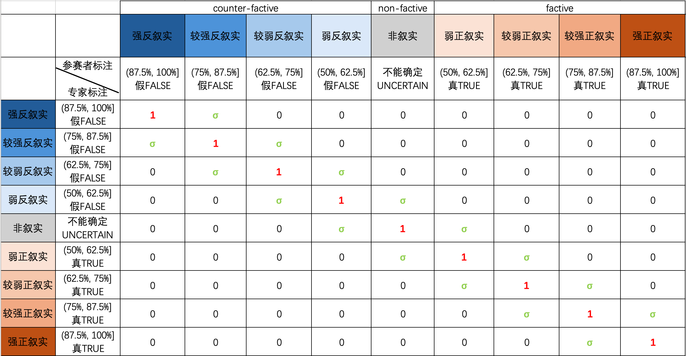

<div align="center">
    
    &nbsp;&nbsp;
    
    &nbsp;&nbsp;
    
</div>

Shared Task 1 of the 25th China National Conference on Computational Linguistics (CCL 2026)<p align="right"><font size=50>[中文版](README.md)</font></p>

# <p align="center"><font size=50><strong>第二届中文叙实性推理评测</strong></font></p> <p align="center"><font size=50>Factivity Inference Evaluation 2026 (FIE2026)</font></p>


<!------------------------------------------------------------------------------------------------------------------------------------------------------------------------------------------------------------------------->

# Recent Updates

 Updated the "Registration Notes," `#10 Frequently Asked Questions`, and the [Submission File Specifications](submission_spec.md). Thanks to Mr./ Ms. Zhao Peixiang for pointing out the error concerning `confidence` on the "Submission File Specifications" page.

 Updated site structure: revised `#5 Evaluation Data` and `#7 Evaluation Criteria`. Added [Sample Set 20260401](sample%20sets/sample_20260401.json).

 Fixed the explanation errors in Examples 5–8 of the "Task Overview" (thanks to Mr./ Mrs. BingJie for pointing this out).

 Updated site structure: added "Frequently Asked Questions"; updated descriptions for "Registration Process" and "Evaluation Data". Added [README_EN.md](README_EN.md).

 Updated site structure; added the [Participation Agreement](https://github.com/UM-FAH-Yuan/FIE2026/blob/main/Agreement%20%26%20License/Participation%20agreement%20on%20FIE2026.pdf).

 Updated site structure; added [Submission File Specifications](submission_spec.md).

 Updated site structure.

# 1 Evaluation Schedule (Tentative)

- March–April 2026: [Task announcement](http://cips-cl.org/static/CCL2026/cclEval/taskEvaluation/index.html) (completed) & team registration (ongoing);
- By April 1, 2026: Release of the [first batch of sample data](sample%20sets/sample_20260401.json) (completed);
- May 2026: Official evaluation set released (available for download within 7 days of release); participating teams conduct evaluation within 7 days;
- June 2026: Participating teams submit technical reports for review;
- July 2026: Technical report review; acceptance notifications sent;
- August 2026: Camera-ready versions of evaluation papers submitted;
- September 2026: Proofreading and typesetting of evaluation papers; submission for ACL/CCL Anthology inclusion (TBD);
- October 2026: CCL 2026 Shared Task Workshop held.

<!------------------------------------------------------------------------------------------------------------------------------------------------------------------------------------------------------------------------->

# 2 Registration Process

1. Please download and carefully read the [*Participation Agreement for the 2nd Chinese Factivity Inference Evaluation FIE2026*](https://github.com/UM-FAH-Yuan/FIE2026/blob/main/Agreement%20%26%20License/Participation%20agreement%20on%20FIE2026.pdf) (hereinafter "the Agreement"). If the PDF fails to display, please try a different browser; Chrome is recommended.
2. The team leader should fill in the team name in the "Team Declaration" section of the Agreement, sign their name and date, and send the signed Agreement as an email attachment to: tianqi.xun@connect.um.edu.mo.
3. In the body of the registration email, please provide team information in the following table format:

| | Example |
|-----|-----|
| Team Name | Occam's Razor |
| Team Contact Person| CONG Guanliang |
| Affiliation  | Department of Chinese Language and Literature, Faculty of Arts and Humanities, University of Macau |
| Intended Track(s) | Prompt Track + Fine-Tuning Track |

The email subject should follow the format: "FIE2026 Registration + Affiliation + Contact Person". For example: "FIE2026 Registration - University of Macau - CONG Guanliang".

Registration Notes:

- The team leader may not participate in another team as a member.
- There is no limit on the number of team members.
- The team name may be modified before the evaluation begins, and is used solely to distinguish teams during the evaluation — not for paper writing.
- The team contact person is primarily responsible for email communication with the organizers and is not recommended to be changed during the evaluation.
- Affiliation information may be modified before the evaluation ends and will ultimately appear in the leaderboard and the evaluation overview paper.
- The intended track(s) may be changed at any time before the evaluation ends.
- If your current affiliation has not yet been finalized, you may participate as an individual.
- To ensure fairness in the evaluation, participants may not compete under the name of an organizer-affiliated institution.
- The organizers are planning to launch a leaderboard website; once it goes live, it will support registration and result submission.

# 3 Organizing Team

- Task Organizers: Prof. Yuan Yulin (University of Macau), Prof. Li Bin (Nanjing Normal University).

- Task Contacts:
Cong Guanliang (PhD student, University of Macau, guanliang.cong@connect.um.edu.mo),
Xun Tianqi (PhD student, University of Macau, tianqi.xun@connect.um.edu.mo).

- Team Members: Prof. Lu Dawei (Renmin University of China), Wu Junchao (PhD student, University of Macau), Zhou Liwei (PhD student, University of Macau), Chen Yang (PhD student, University of Macau), Xu Mai (PhD student, University of Macau), Liu Daohuan (PhD student, Huazhong University of Science and Technology), Li Changling (Master's student, University of Macau), Wang Yueyao (Master's student, University of Macau), Li Zehua (Master's student, University of Macau), Li Junhou (Master's student, University of Macau), Yang Yang (Master's student, University of Macau), Liu Ruoxi (Master's student, University of Macau), Zhu Zhixin (Master's student, University of Macau), Tao Suwen (Master's student, University of Macau).

<!------------------------------------------------------------------------------------------------------------------------------------------------------------------------------------------------------------------------->

# 4 Task Overview

Factivity Inference (FI) is a semantic understanding task concerned with the judgment of event factuality, primarily involving the expression of factual information in language use. In human communicative interaction, factivity inference manifests as the ability of language users to infer the truth value (true or false) of events described by certain linguistic elements based on the use of verbal predicates (e.g., *believe*, *falsely claim*, *realize*). For example:

    (1) 他们意识到局面已经不可挽回。They realized the situation was already irreversible.
    (2) 他们没有意识到局面已经不可挽回。They did not realize the situation was already irreversible.

From both the affirmative sentence in (1) and the negative sentence in (2), one can infer the following fact from the speaker's perspective: "the situation was already irreversible."

The knowledge deployed in factivity inference is an analytical knowledge of language — largely independent of world knowledge — that primarily concerns the semantic relationships among elements within a linguistic structure. For instance, the verb *realize* in the examples above presupposes that its complement ("the situation was already irreversible") is true, regardless of whether a negation marker precedes the verb.

Closely related to factivity inference is Counter-Factual Inference (CFI). Both are forms of factuality-related inference in semantic understanding, collectively referred to as "Factuality Inference" (FactI). Comparatively, factivity inference is primarily expressed through predicates (e.g., verbs), while counter-factual inference is primarily expressed through counterfactual conditionals. For example:

    (3) 约翰不知道罗昆是中国人。John did not know that Rokun was Chinese.
    (4) 要不是消防队来得及时，大火就要烧到顶楼了。Had the fire brigade not arrived in time, the fire would have spread to the top floor.

From the verb *know* in (3), one can infer the fact: "Rokun is Chinese." From the counterfactual conditional in (4), one can infer two facts: "the fire brigade did arrive in time" and "the fire did not spread to the top floor."

As an important navigational mechanism and means of linguistic inference, factuality inference has clear formal cues in language and constitutes a crucial semantic foundation for machines performing tasks such as textual entailment recognition, hallucination resolution, and belief revision. It also holds significant value for downstream tasks including information retrieval, information extraction, question answering, and sentiment analysis. Today's Large Language Models (LLMs) are increasingly capable of autonomous interaction with the world in human-like ways and are also referred to as "agents." Extracting factual information from discourse and understanding a speaker's subjective attitude toward the truth of events is critically important for the autonomous reasoning of agents and for the fluency of human-computer interaction.

To further enhance the semantic understanding capabilities of large language models for Chinese, and to achieve deep machine comprehension of human communicative discourse, we are launching the "2nd Chinese Factivity Inference Evaluation" (FIE2026), building on the foundation of FIE2025 ([see Website](https://github.com/UM-FAH-Yuan/FIE2025); [see Overview](https://github.com/UM-FAH-Yuan/FIE2026/blob/main/papers%20of%20FIE2025/68.pdf); [see papers](https://github.com/UM-FAH-Yuan/FIE2026/tree/main/papers%20of%20FIE2025)).

This evaluation focuses on examining how LLM performance on factivity inference varies across different real-world contexts. In particular, it investigates model performance under complex contextual conditions, such as the presence of different negation words, different negation intentions, different evaluative adverbials, subjects of different persons and quantities, as well as polyphony markers and passivization markers. For example:

    (5) 他错误地认为地球是平的。He mistakenly believed that the Earth is flat.
    (6) 没有证据表明抽烟可以防止病毒感染。There is no evidence that smoking can prevent viral infection.
    (7) 我不能相信他竟是一个八十多岁的老人。I can't believe he is actually a man in his eighties.
    (8) 我不能相信人可以长生不老。I can't believe a person can live forever.

From (5), one can infer that "the Earth is flat" is almost certainly false. From (6), one can infer that "smoking can prevent viral infection" is highly likely to be false. From (7), one can infer that "he is a man in his 80s" is highly likely to be true. From (8), one can infer that "a person can live forever" is highly likely to be false.

Participating teams are required to design their own prompts using the dataset released by the organizers, query LLMs with those prompts, and organize the results into a unified output format. Each data instance is presented as a textual entailment pair ⟨Aa, a⟩ and stored in JSON format.

The model must judge the truth value of the entailed sentence *a* based on the content of the entailing sentence *Aa*, and provide a confidence score for that judgment. For example:

    Entailing sentence Aa: 老张并没有注意到她今天穿了一件红色的连衣裙。Lao-Zhang did not notice that she was wearing a red dress today.
    Entailed sentence a: 她今天穿了一件红色的连衣裙。She was wearing a red dress today.
    Model judgment: The entailed sentence is 95% likely to be true.
    Output (JSON fields): {"factivity": "TRUE", "confidence": 0.95}

In addition, this evaluation continues to offer two tracks: the **Prompt Track** and the **Fine-Tuning Track**. The Prompt Track does not allow any modification of model parameters; teams may only improve performance through prompt engineering. The Fine-Tuning Track allows teams to select open-source models and fine-tune model parameters using the provided sample set data. Teams are encouraged to explore diverse and combined testing approaches to achieve better performance.

**Note:** Regardless of which track a team participates in, the number of few-shot examples provided to the model for obtaining a response to any single data instance must not exceed 3 (3-shot at most).

<!------------------------------------------------------------------------------------------------------------------------------------------------------------------------------------------------------------------------->

# 5 Evaluation Data

## 5.1 Scale and Source

The evaluation provides both a sample set and an evaluation set in JSON format. The [sample set](sample%20sets) contains approximately 500–1,000 instances, and the evaluation set contains approximately 2,000–4,000 instances. The corpus is sourced from relevant real-world corpora by the organizing team, and has been adapted, annotated, and proofread.

Since the evaluation targets large language models, no training or validation sets are provided. Teams participating in the Fine-Tuning Track may use the sample set for model fine-tuning and may partition it into training and validation subsets at their discretion.

## 5.2 Data Fields

(1) **id**: Data identifier. IDs follow the format "track code_data number." The track code `pr` indicates data for the Prompt Track; `ft` indicates data for the Fine-Tuning Track. Data IDs in the sample set follow the `sp_XXX` encoding format.

(2) **text**: The background sentence (entailing sentence). This field provides the context needed for factivity inference; the model must use this as the basis for judging the truth value of the hypothesis.

(3) **hypothesis**: The hypothesis sentence (entailed sentence). This field provides the proposition to be evaluated; the model must judge its truth value based on the content of the background sentence.

(4) **factivity**: The factivity judgment. The model's judgment of the truth value of the hypothesis is written into this field. Valid values are `"TRUE"`, `"FALSE"`, and `"UNCERTAIN"`.

(5) **confidence**: The confidence level of the factivity judgment, i.e., the degree to which the hypothesis is considered true or false given the `text` field. When `factivity` is `"TRUE"` or `"FALSE"`, the valid range of `confidence` is `(0.50, 1.00]` (left-open, right-closed). When `factivity` is `"UNCERTAIN"`, `confidence` must be fixed at `0.50`.

Sample-set entries contain all five fields above; evaluation-set entries contain only `id`, `text`, and `hypothesis`.

## 5.3 Data Examples

```json
[ {
        "id": "sp_001",
        "text": "老张并没有注意到她今天穿了一件红色的连衣裙。",
        "hypothesis": "她今天穿了一件红色的连衣裙。",
        "factivity": "TRUE",
        "confidence": 0.95
    },
{
        "id": "sp_002",
        "text": "他错误地认为地球是平的。",
        "hypothesis": "地球是平的。",
        "factivity": "FALSE",
        "confidence": 0.99
    },
{
        "id": "pr_003",
        "text": "他认为那家新开的餐厅定价过高，普通工薪阶层根本消费不起。",
        "hypothesis": "新开的餐厅定价过高。",
        "factivity": "UNCERTAIN",
        "confidence": 0.50
    } ]
```

More data examples are available in the [sample set](sample%20sets).

## 5.4 Task Description

The organizers will provide participating teams with a sample set and an evaluation set. Evaluation data is presented as textual entailment pairs ⟨Aa, a⟩. All data is stored in JSON format.

The model must judge the truth value of the entailed sentence *a* based on the content of the entailing sentence *Aa*, and provide a confidence score for that judgment. For example:

    Entailing sentence Aa: Lao-Zhang did not notice that she was wearing a red dress today.
    Entailed sentence a: She was wearing a red dress today.
    Model judgment: The entailed sentence is 95% likely to be true.
    Output (JSON fields): {"factivity": "TRUE", "confidence": 0.95}

- Participating teams must independently select one or more large language models (model type and parameter count are unrestricted); design their own prompts using the released dataset; send each instance to the model; instruct the model to judge the truth value of the `hypothesis` field based on the `text` field; record the model's responses; and finally organize all results into a JSON-format data file.
- Truth values include three categories:
  - If the model determines, based on the background sentence, that the hypothesis is **true**, write `"TRUE"` in the `factivity` field, and write the model's confidence score in the `confidence` field (i.e., the degree to which the model believes the hypothesis is true). The confidence value range is `(0.5, 1]`, and the field value is a **number** (numeric value rounded to two decimal places).
  - If the model determines, based on the background sentence, that the hypothesis is **false**, write `"FALSE"` in the `factivity` field, and write the model's confidence score in the `confidence` field (i.e., the degree to which the model believes the hypothesis is false). The confidence value range is `(0.5, 1]`, and the field value is a **number** (numeric value rounded to two decimal places).
  - If the model determines that the truth value of the hypothesis **cannot be determined** based on the background sentence, write `"UNCERTAIN"` in the `factivity` field, and write `0.50` in the `confidence` field. The field value type here is **number**.
- If the model refuses to answer, please adjust the prompt and retest.
- If other issues arise, please contact the task organizers by email.
- All resources used by participating teams must be described in detail in the final technical report. All experimental code and results should be carefully saved for verification purposes.

## 5.5 Data Usage Notes and Tips

- Participating teams are required to design their own prompts for conversing with LLMs based on the data content; therefore, no `question` field is included in the data.
- Prompts must include the content of both the `text` and `hypothesis` fields of the current data instance.
- Teams are encouraged to explore diverse prompt designs, such as providing more shots, requiring Chain-of-Thought (CoT), requiring consistency voting, informing the model of the verb type or the factivity category of the verb, varying the question format, etc. Reference may be made to the [papers of FIE2025](https://github.com/UM-FAH-Yuan/FIE2026/tree/main/papers%20of%20FIE2025).

<div id="daimashili"></div>

## 5.6 Output Requirements

- Manual correction of model responses is strictly prohibited.
- Code may be used to uniformly extract model responses, but the code must be designed with reproducibility in mind. Additionally, if a model's response contains contradictory true/false judgments, it is not permissible to extract only one of the judgments — the prompt must be adjusted and the model retested.
- For submission file requirements, please refer to the [Submission File Specifications](submission_spec.md).

<!------------------------------------------------------------------------------------------------------------------------------------------------------------------------------------------------------------------------->

# 6 Track Settings

FIE2026 will continue to feature two tracks: the Prompt Track and the Fine-Tuning Track. The Prompt Track does not allow any modifications to model parameters while participants may only improve model performance through prompt engineering. The Fine-Tuning Track allows participants to select one or more open-source models as the subjects and to fine-tune their parameters using the provided dataset.

The two tracks will be judged separately. Teams may choose to participate in both tracks simultaneously or in only one. Regardless of which track is chosen, the entire evaluation process must be described in detail in their system report.

For both the Fine-Tuning Track and the Prompt Track, prompts are strictly limited to at most three in-context examples (3-shot).
<!------------------------------------------------------------------------------------------------------------------------------------------------------------------------------------------------------------------------->

# 7 Evaluation Criteria

## 7.1 Classification of Factivity Judgments

A model's factivity inference ability is primarily reflected in its judgment of the truth value of relevant events. This evaluation adopts a **[truth-value category + confidence]** "two-parameter" scheme to represent the truth value of an event.

- **Truth-value category** (`factivity`): a nominal variable indicating the model's basic judgment about whether an event is true or false. Valid values are `"TRUE"`, `"FALSE"`, and `"UNCERTAIN"`, meaning that, based on the content of the `text` field, the content of the `hypothesis` field can be inferred to be **true**, **false**, or **not determinable**, respectively.

- **Confidence** (`confidence`): an interval variable indicating the model's confidence in the above judgment. When `factivity` is `"UNCERTAIN"`, `confidence` is fixed at `0.5`; when `factivity` is `"TRUE"` or `"FALSE"`, `confidence` ranges over `(0.5, 1]` (left-open, right-closed).

Based on the combination of these two parameters, the evaluation system maps each answer to one of the following nine **factivity-intensity intervals**:

| Interval Name | Truth-Value Category | Confidence Range |
|:-------------:|:--------------------:|:----------------:|
| Strong Counter-Factive | `FALSE` | (87.5%, 100%] |
| Relatively Strong Counter-Factive | `FALSE` | (75%, 87.5%] |
| Relatively Weak Counter-Factive | `FALSE` | (62.5%, 75%] |
| Weak Counter-Factive | `FALSE` | (50%, 62.5%] |
| Non-Factive | `UNCERTAIN` | 0.5 (fixed) |
| Weak Factive | `TRUE` | (50%, 62.5%] |
| Relatively Weak Factive | `TRUE` | (62.5%, 75%] |
| Relatively Strong Factive | `TRUE` | (75%, 87.5%] |
| Strong Factive | `TRUE` | (87.5%, 100%] |

## 7.2 Scoring Method

To evaluate LLMs' factivity inference ability more accurately, this evaluation adopts **gradient matching** for scoring: the closer the interval predicted by the model is to the gold interval, the higher the score. The specific rules are as follows:

- If the model answer and the gold answer fall in the **same interval**, the score is **1**;
- If the interval of the model answer is **adjacent** to that of the gold answer, the score is **σ** (σ ≈ 0.6827);
- If the interval of the model answer is **not adjacent** to that of the gold answer, the score is **0**.

The complete scoring relationship among intervals is shown in the matrix below (rows correspond to model answers submitted by participating teams; columns correspond to gold answers annotated by experts):

<div align="center">
    
</div>

> Note: σ ≈ 0.6827, corresponding to the probability mass within one standard deviation of a normal distribution.

A team's **final score** is the **sum** of its scores over all evaluation instances.

<!------------------------------------------------------------------------------------------------------------------------------------------------------------------------------------------------------------------------->

# 8 Technical Report Requirements

Submission of a technical report is mandatory for all participating teams. Teams that do not submit a technical report will not have their results recognized. Requirements are as follows:

1. Reports may be written in either Chinese or English.
2. All reports must use the official CCL 2026 paper template.
3. The main body of the report must not exceed 6 pages; the references section has no page limit.
4. Reports must include at least the following four sections: Model Description, Evaluation Results, Analysis and Discussion, and References.
5. Conference submissions must use the LaTeX template.
6. As this conference uses double-blind review, author names and affiliations must not appear in the submitted paper. Authors must not use the phrasing "we propose" when self-citing; instead, use the format "Author Name proposes…".
7. Papers that do not meet these requirements will be rejected without going through the full review process.
8. Paper template download link: (to be updated).

<!------------------------------------------------------------------------------------------------------------------------------------------------------------------------------------------------------------------------->

# 9 Awards

This evaluation will award first, second, and third prizes to the top-performing teams in both the Prompt Track and the Fine-Tuning Track separately. Prize amounts are to be determined.

Award structure for each track:
- First Prize: 0–1 team
- Second Prize: 0–2 teams
- Third Prize: 0–3 teams

<!------------------------------------------------------------------------------------------------------------------------------------------------------------------------------------------------------------------------->

# 10 Frequently Asked Questions (Ongoing Updates)

- **Q1**: Is the model allowed to output content other than T/F/U/R when generating an answer? For example, generating a CoT reasoning chain before manually extracting the final answer?
- **A1**: Yes. As long as the answer portion of the model's response is unambiguous (i.e., it clearly states "true/false/uncertain" or equivalent) and internally consistent (i.e., no contradictory answers appear within a single response). If answers are extracted manually, a clear, consistent, and reproducible extraction rule must be provided in the technical report, and the code must be saved for potential inspection.

- **Q2**: Is multi-turn dialogue allowed?
- **A2**: In principle, we allow various querying approaches including multi-turn dialogue. However, it is ~~discouraged~~ **prohibited** to manually guide the model to correct its responses mid-dialogue — for example, saying "You're wrong; I think the answer should be…" — as this would undermine the evaluation of the model's genuine factivity inference capabilities.

- **Q3**: Will any data from the sample set appear again in the evaluation set?
- **A3**: No. Counting by data ID, the sample set and the evaluation set will not contain fully overlapping instances. However, predicates appearing in the sample set may reappear in the evaluation set. To test the generalization ability of models, the number of factivity predicates in the sample set will be greater than [*text appears incomplete in the original*].

- **Q4**: Compared to FIE2025, why does this year's dataset no longer provide predicate items and predicate types?
- **A4**: Predicates are one of the core components of factivity inference, and our dataset is built around predicates as its core. During last year's evaluation, we found that many teams designed differentiated prompts for different predicates. We believe this practice deviates from our original intention of testing the linguistic capabilities of LLMs. In natural human communication, knowledge such as "if the main clause uses a positive factive predicate, the embedded clause is likely true" exists only as an internalized form of linguistic knowledge in people's minds — it is unlikely to appear explicitly in the natural flow of speech. The ultimate goal of this evaluation task is to explore, through diverse testing methods, the extent to which the linguistic capabilities of large language models can approach those of humans.

- **Q5**: Why has a limit on the number of shots been added this year?
- **A5**: This year we have added a new requirement for prompt design: the number of few-shot examples provided to the model for obtaining a response to any single data instance must not exceed 3 (3-shot at most). This requirement applies to both tracks. The reason is that, when analyzing last year's evaluation results, we found that models supporting long contexts achieved accuracy improvements far exceeding other testing methods when a large number of example answers were included in the prompt. However, this approach similarly deviates from our original intention of evaluating the genuine linguistic capabilities of LLMs.

- **Q6**: Does the model need to rely on world knowledge when generating answers?
- **A6**: Different orientations in a model's knowledge sources may indeed have some influence on factivity judgments, but such bias can be mitigated through prompt engineering or model fine-tuning. Participating teams are encouraged to try diverse evaluation methods during the official evaluation period in order to obtain better results.

- **Q7**: When the value of `factivity` is `"UNCERTAIN"`, why must the value of `confidence` be uniformly set to `0.50`?
- **A7**: This is mainly for the sake of format consistency. When the value of `factivity` is `"UNCERTAIN"`, it means that the listener / large language model is not confident in judging the truth value of the entailed sentence. From the perspective of data type, we treat such "uncertainty" as nominal data contrasted with relatively certain truth-value judgments, but without internal gradience. For "true" or "false," we can say "60% confident that the event described in the complement clause is true" or "90% confident that the event described in the complement clause is false"; but for "uncertain," there is no essential difference between "20% confident" and "45% confident." Therefore, we fix the confidence of `UNCERTAIN` at `0.50`: on the one hand, this keeps the format consistent with the other two labels; on the other hand, it reminds participating teams that, for items whose `factivity` value is `TRUE` or `FALSE`, the confidence must be greater than `0.50` (excluding `0.50`).

<!------------------------------------------------------------------------------------------------------------------------------------------------------------------------------------------------------------------------->

# 11 References (Ongoing Updates)

[1] Chen Zhenyu & Jiang Yining. (2018). Factuality and factivity — The opacity and transparency of the declarative world. *Studies in Linguistics*, (01), 15–37+372–373. doi:CNKI:SUN:YJJK.0.2018-01-002.

[2] Yuan Yulin. (2014). The factivity and negative polarity item licensing of implicit negation verbs. *Language Science*, (06), 575–586. doi:CNKI:SUN:YYKE.0.2014-06-002.

[3] Yuan Yulin. (2020). The factivity drift of "forget"-type verbs and its conceptual structure basis. *Chinese Linguistics*, (05), 515–526+638. doi:CNKI:SUN:YWZG.0.2020-05-001.

[4] Yuan Yulin. (2020). Factivity and factuality: Two navigational mechanisms of linguistic inference. *Linguistic Research*, (01), 1–9. doi:CNKI:SUN:YWYJ.0.2020-01-001.

[5] Yuan Yulin. (2020). The factivity drift of "remember" and its conceptual structure basis. *Language Teaching and Linguistic Studies*, (01), 36–47. doi:CNKI:SUN:YYJX.0.2020-01-007.

[6] Yuan Yulin. (2021). The interpretive ambiguity of "pretend" sentences from the perspective of linguistic "polyphony." *Language Strategy Research*, (05), 77–90. doi:10.19689/j.cnki.cn10-1361/h.20210506.

[7] Zhang Fan. (2024). Types of complements of "pretend"-type verbs and the rationale for truth-value judgments. *Journal of Chinese Linguistics*, (00), 157–170. doi:CNKI:SUN:XBYT.0.2024-00-012.

[8] Li Xinliang. (2018). On the factivity and its drift in "feel/sense"-type verbs. *Language Teaching and Linguistic Studies*, (05), 65–75. doi:CNKI:SUN:YYJX.0.2018-05-007.

[9] Li Xinliang. (2020). *A Study on the Factivity of Verbs in Modern Chinese*. Beijing: Peking University Press.

[10] Li Xinliang & Yuan Yulin. (2016). The grammatical conditions for the truth value of complements of counter-factive verbs and their conceptual motivations. *Contemporary Linguistics*, (02), 194–215. doi:CNKI:SUN:DDYX.0.2016-02-004.

[11] Li Xinliang & Yuan Yulin. (2017). The factivity of "know" and the grammatical environments conditioning its confidence variation. *Chinese Linguistics*, (01), 42–52+127. doi:CNKI:SUN:YWZG.0.2017-01-003.

[12] Li Xinliang, Yuan Yulin, et al. (2023). *Theories of Factivity and Factuality and Their Applications*. Beijing: Foreign Language Teaching and Research Press.

[13] Kiparsky & Kiparsky. (1970). Fact. In M. Bierwisch & K. Heidolph (eds.), *Progress in Linguistics*. The Hague: Mouton. 143–147.

[14] Yuan Yulin. (2023). The factivity-reversal function and magical effect of the "X cannot believe Y" construction — Expressing the psychological experience of 'reluctantly suspending disbelief after facts overturn beliefs.' *Chinese Linguistics*, (04), 387–399+510.

[15]Cong, Guanliang, Junchao Wu, Yang Chen, Tianqi Xun, Derek F. Wong, Bin Li & Yulin Yuan. (2025). Overview of CCL25-Eval Task 4: Factivity Inference Evaluation 2025. Proceedings of the 24rd Chinese National Conference on Computational Linguistics (Volume 2: Evaluations).[https://aclanthology.org/2025.ccl-2.20](https://github.com/UM-FAH-Yuan/FIE2026/blob/main/papers%20of%20FIE2025/68.pdf) 
